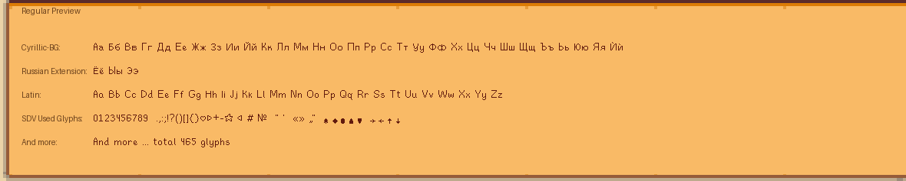
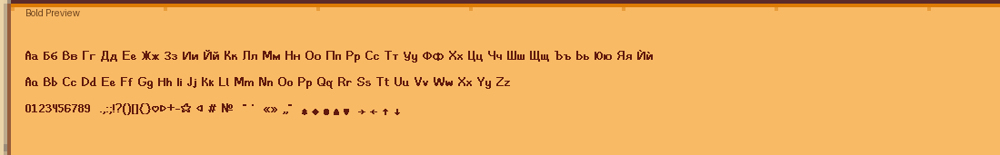
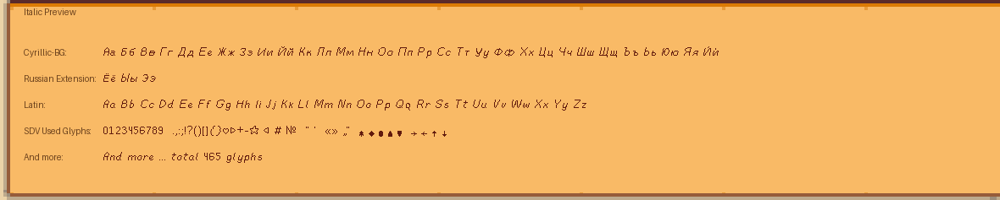

# Stardew Cyrillic Fonts

Community reconstruction of Stardew Valley's fan Cyrillic font family and BG-complete font assets.

## License

- `LICENSE-CODE` covers the scripts and documentation in this project.
- `ASSET-NOTICE.md` covers game-derived assets and derivative bitmap/font materials.

## Included

- `Regular`, `Bold`, and `Italic` installable TTF files
- glyph PNG sources for further editing
- generated `Cyrillic.fnt` test output
- build scripts for family assembly, BMFont generation, preview rendering, and packaging

## Toolchain

This project uses [bmfont_studio](https://github.com/AcTePuKc/bmfont_studio).

Some scripts expect the toolchain to be available through:

- `BMFONT_PYTHON_ROOT`
- a local `BMFont-Python` checkout
- a sibling `BMFont-Python` folder next to this repository

## Main folders

- `build-scripts/`
- `font-family-work/`
- `russian-bg-work/`
- `russian-bg-bold-work/`
- `russian-bg-italic-work/`
- `final-build/`
- `source-assets/`

## Previews

### Regular

### Bold

### Italic

